# Proof-of-Concept für plattformübergreifende UI-Tests der Element-Messenger-Clients mit Webdriver.io + Appium

## Screenshots aus den Test-Läufen

### Web — Chrome multiremote (Alice + Bob parallel)

|       | 1. Login | 2. Raum offen | 3. Nachricht gesendet | 4. Nachricht empfangen |
|-------|----------|---------------|-----------------------|------------------------|
| Alice | 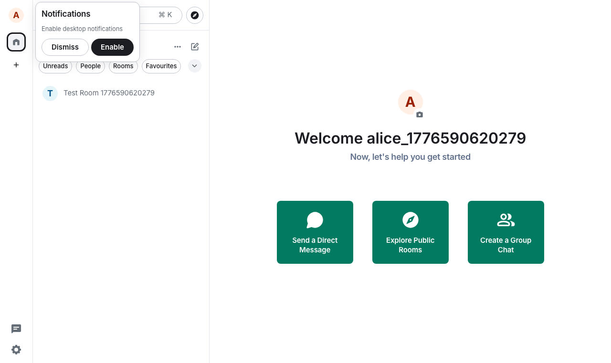 | 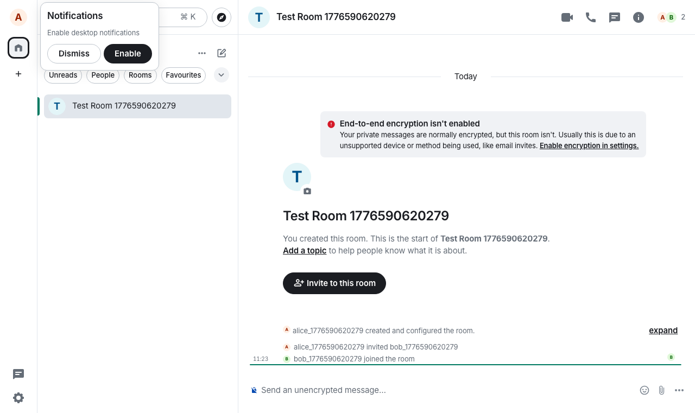 |  | 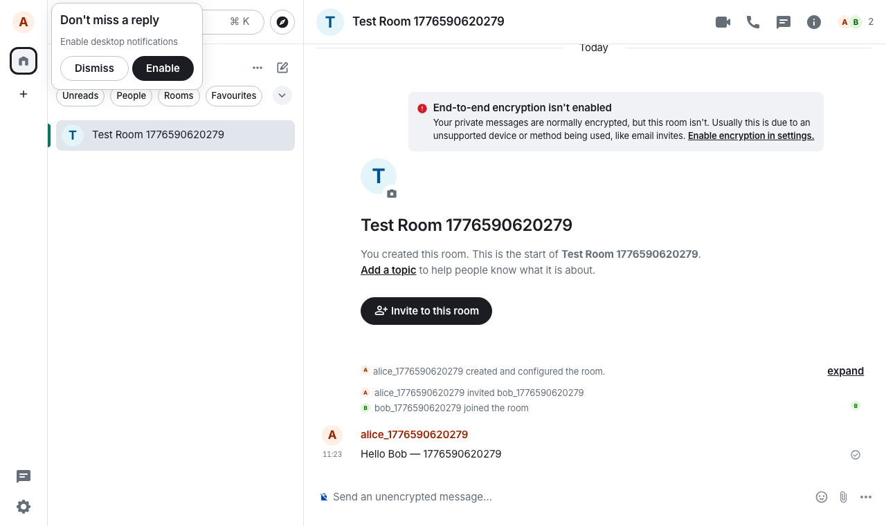 |
| Bob   | 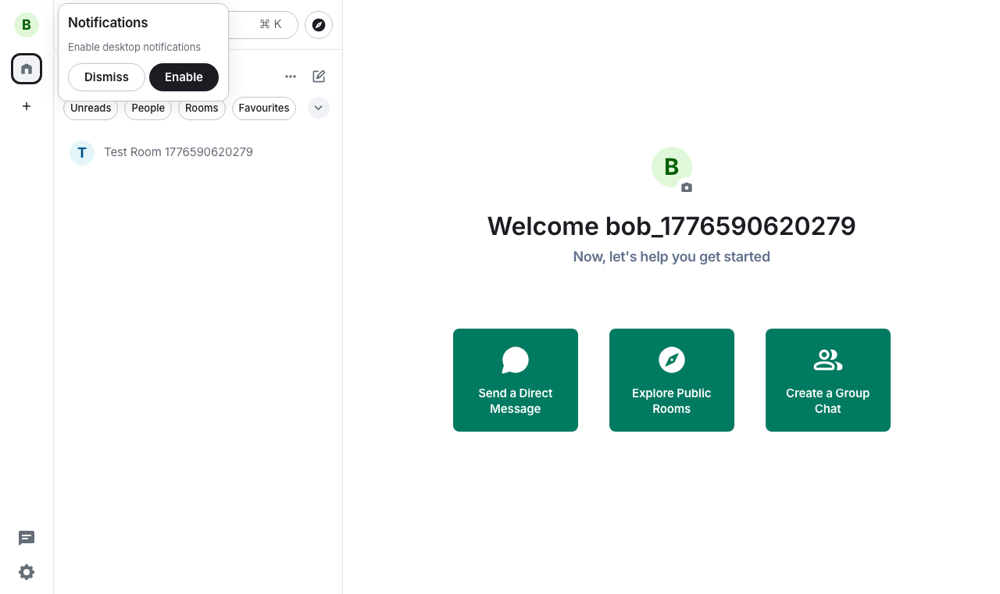   | 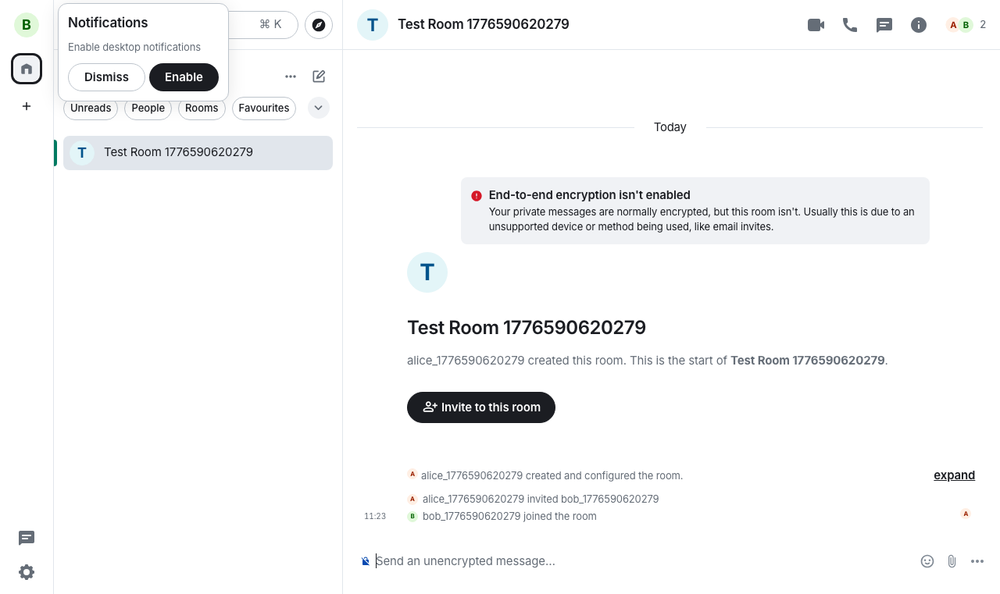   | 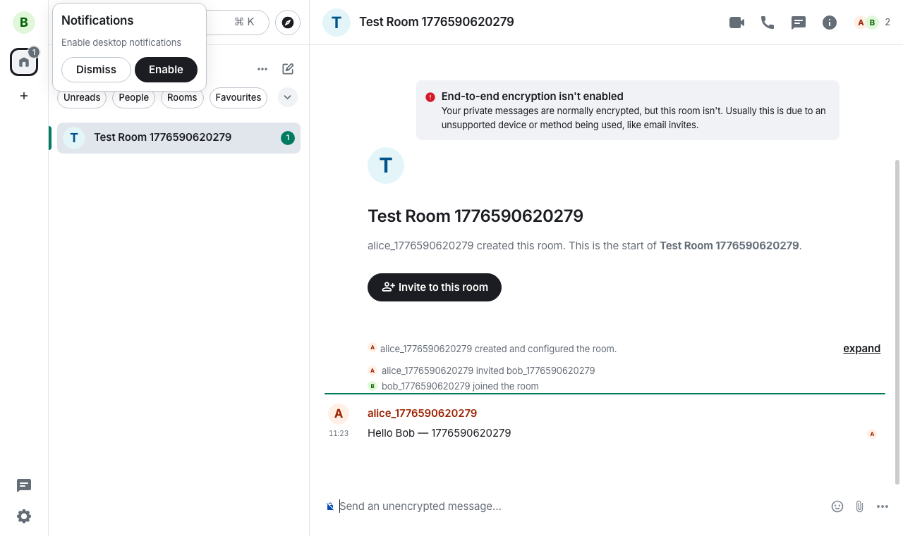   |    |

### Android — Element X, zwei Emulatoren parallel

|       | 1. Login | 2. Raum offen | 3. Nachricht gesendet | 4. Nachricht empfangen |
|-------|----------|---------------|-----------------------|------------------------|
| Alice | 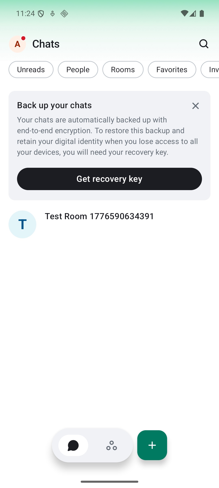 | 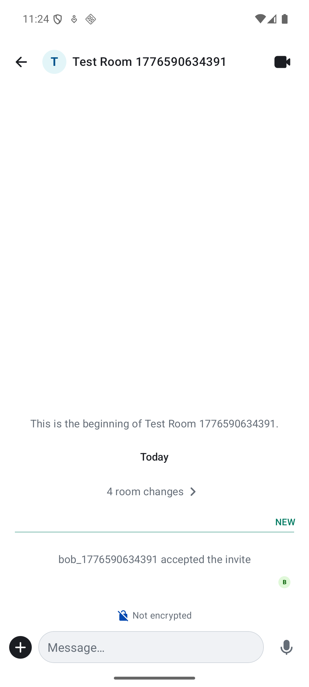 |  | 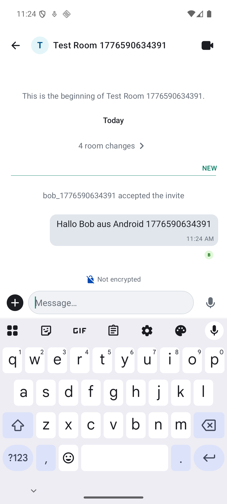 |
| Bob   | 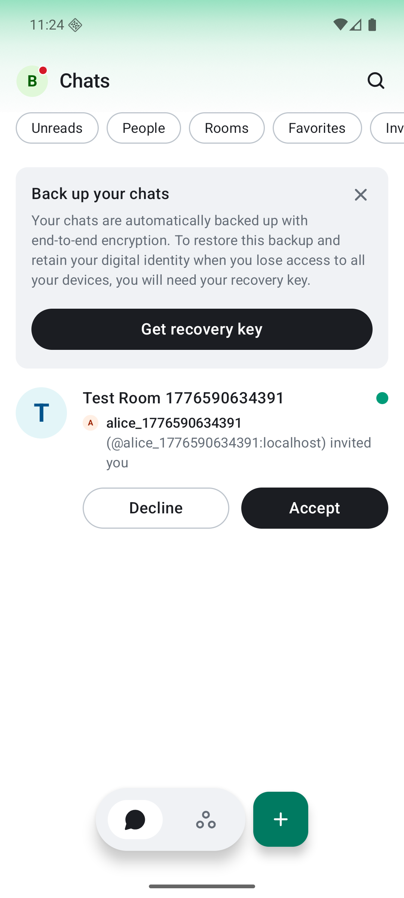   | 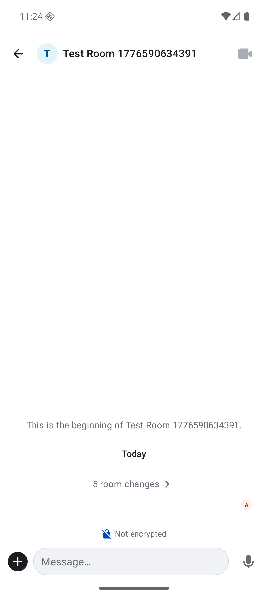   | 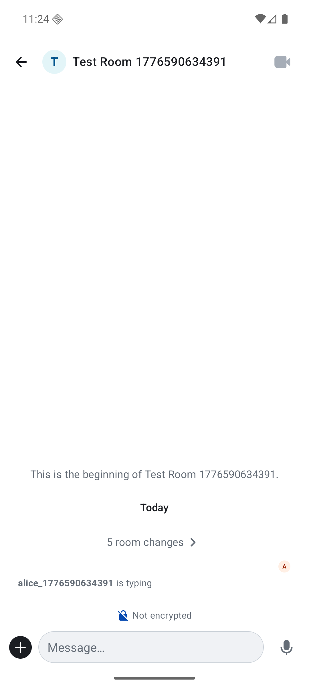   | 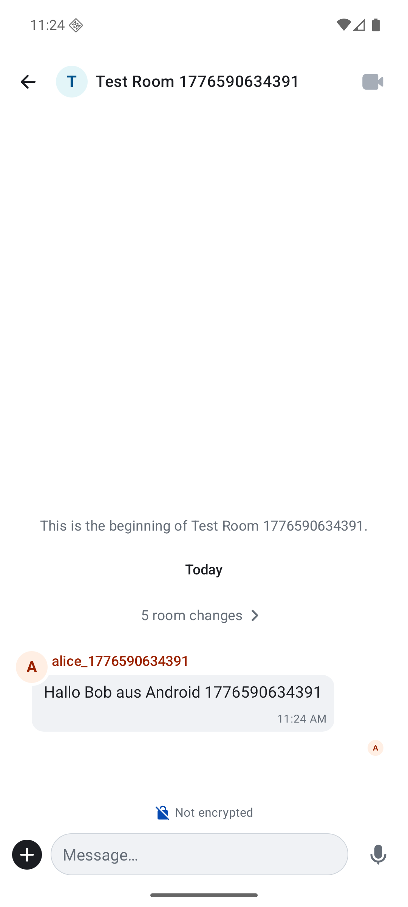   |

## Hintergrund

Dieser POC ist über ein Wochenende im Rahmen meiner Bewerbung als Senior
Test Automation Engineer für den BundesMessenger entstanden. Er demonstriert
die Methodik und den Werkzeug-Stack, der sich direkt auf den BundesMessenger
übertragen lässt.

### Warum Element statt BundesMessenger?

BundesMessenger ist ein Fork von Element-Web / Element-X — Element ist
Open Source und frei verfügbar.

### Warum unverschlüsselte Räume im POC?

Fokus liegt auf dem UI-Flow (Composer, Timeline, Invite-Annahme).
E2EE-Tests benötigen zusätzliches Crypto-Setup (Cross-Signing,
Device-Verification) im `before`-Hook, ändern aber weder Page Objects
noch Specs. Selbstverständlich nur für den POC — produktiv käme das
nicht in Frage.

## Inhalt

- **[`ui-tests/`](./ui-tests/README.md)** — Proof-of-Concept UI-Tests, komplett
  reproduzierbar gegen einen lokalen Synapse + Element-Web via Docker.
  Zwei Plattformen funktionieren grün:
  - **Web** — Chrome multiremote (Alice + Bob), direkter Send/Receive-Test
  - **Android** — Appium + UIAutomator2, zwei Emulatoren parallel, element-x-android
    als gepatchte APK (`cleartextTrafficPermitted=true` für Cleartext-HTTP
    zum lokalen Homeserver)
  - **iOS** — Platzhalter, noch nicht aktiviert

## GitHub Actions

Beide UI-Test-Suiten laufen im CI auf jedem Push und PR (nur bei Änderungen
unter `ui-tests/` oder am jeweiligen Workflow):

- **[`ui-tests-web.yml`](./.github/workflows/ui-tests-web.yml)** — GitHub-Ubuntu-Runner,
  Docker-Stack + headless Chrome × 2, ~1–2 min pro Run
- **[`ui-tests-android.yml`](./.github/workflows/ui-tests-android.yml)** — Self-hosted
  M1-Runner (alle Tools lokal vorhanden), zwei arm64-Emulatoren, ~3–5 min pro Run

Screenshots der Test-Schritte (Login, Raum-Öffnen, Nachricht gesendet, empfangen)
werden als Artifact hochgeladen und in der Step-Summary aufgelistet — sowohl
bei Erfolg als auch bei Fehlschlag.

## Schnellstart

Details stehen in [`ui-tests/README.md`](./ui-tests/README.md). Kurz:

```bash
cd ui-tests
npm install
npm run synapse:setup && npm run synapse:up
npm run test:web                    # Web-Tests
bash scripts/setup-emulator.sh      # nur für Android
bash scripts/patch-apk.sh           # nur für Android (einmalig)
npm run test:android                # Android-Tests
```
